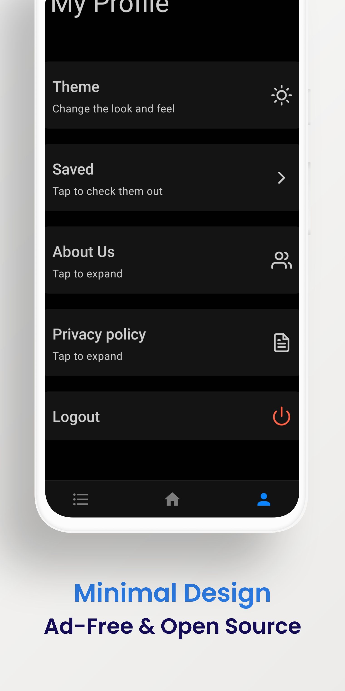

# Freads

## Table of Contents

- [About](#about)
- [Getting Started](#getting_started)
- [Features](#features)

## About

it's a Rss News app made with React Native and Expo.

## Getting Started

- Install dependencies: `yarn install` (or `npm install`).

- Run on both Android & iOS: `expo start` (or `npm start`).

- Run on Android: `yarn android` (or `npm run android`).

- Run on iOS: `yarn ios` (or `npm run ios`).

### Preview

## Features

- Synced Feeds
- Saved feeds for later
- Dark theme and light theme
- Minimal design
- Free and ad-free
- and much more..

## Server

- The Server is an Django Project, which is also open source.
- You can find it [here](https://github.com/Mazahir26/rssnewsdjango)

## Testing

- it has been Tested on Andriod 10.0
- it uses expo SDK 42
- if you find any bugs, please raise an issue

## Assets

- React Native Paper
- expo-linear-gradient
- lottie
- react-native-rss-parser
- react-native-pager-view
- react-native-animatable
- undraw.com

## License

This project is licensed under the MIT License - see the [LICENSE.md](LICENSE.md) file for details

## Thank You

Thanks for checking out my project, feel free to fork it.
